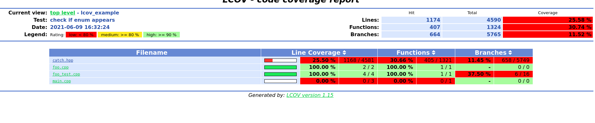

# Lcov examples

### enum example - Goal

Is an enum defined in a header file considered as instrumented in lcov calculation?

### Run the example
(C++14)

Ran using ``lcov 1.15``, `g++- 8.4.0`, and the `.lcovrc` commited here.

Running ``generate_report.sh``, will do the following:

````
g++-8 -c foo.cpp -fprofile-arcs -ftest-coverage --std=c++14 -o foo.compiled
g++-8 -c main.cpp -fprofile-arcs -ftest-coverage --std=c++14 -o main.compiled
g++-8 -o foo_binary foo.compiled main.compiled -fprofile-arcs -ftest-coverage --std=c++14 
lcov --no-external --capture --initial --directory . --output-file baseline.info
g++-8 -o main_test -fprofile-arcs -ftest-coverage --std=c++14 foo_test.cpp foo.cpp
./main_test
lcov --no-external --capture --directory . --output-file after_test.info
lcov --add-tracefile baseline.info --add-tracefile after_test.info --output-file final_lcov.info
genhtml --ignore-errors source final_lcov.info --legend --title "check if enum appears" --output-directory=genhtml_output
````

After executing this, we can see that **no** `foo.h` is present in the html report.



To cleanup the report, and the intermediate representations generated, one can use ``cleanup.sh``.

### References

- [LCOV Code Coverage for LibreOffice](https://wiki.documentfoundation.org/Development/Lcov)
- [Program Instrumentation Options for gcc 8.4.0](https://gcc.gnu.org/onlinedocs/gcc-8.4.0/gcc/Instrumentation-Options.html)
- [gcov—a Test Coverage Program](https://gcc.gnu.org/onlinedocs/gcc/Gcov.html)
- [Small example on compiler explorer - no enum shown(?) on the stack](https://godbolt.org/z/PxP5M7hMo)
